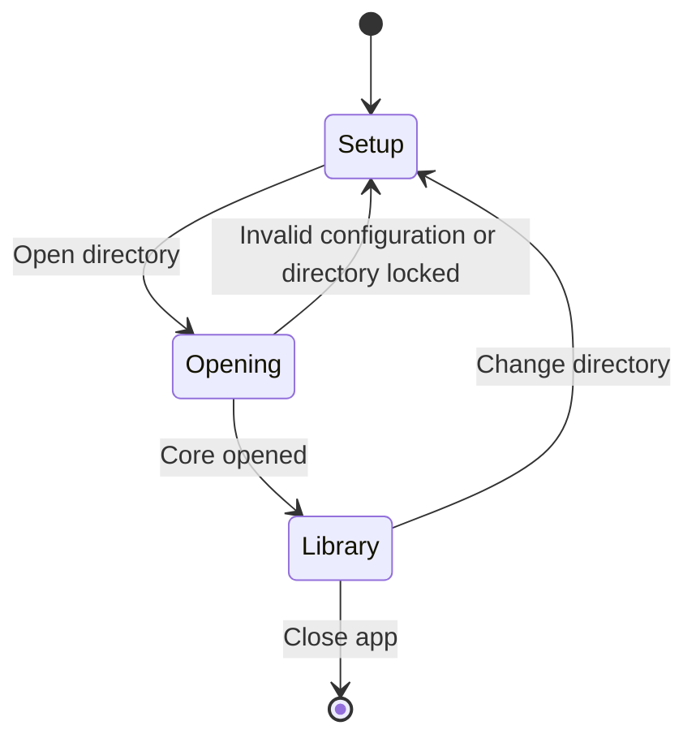
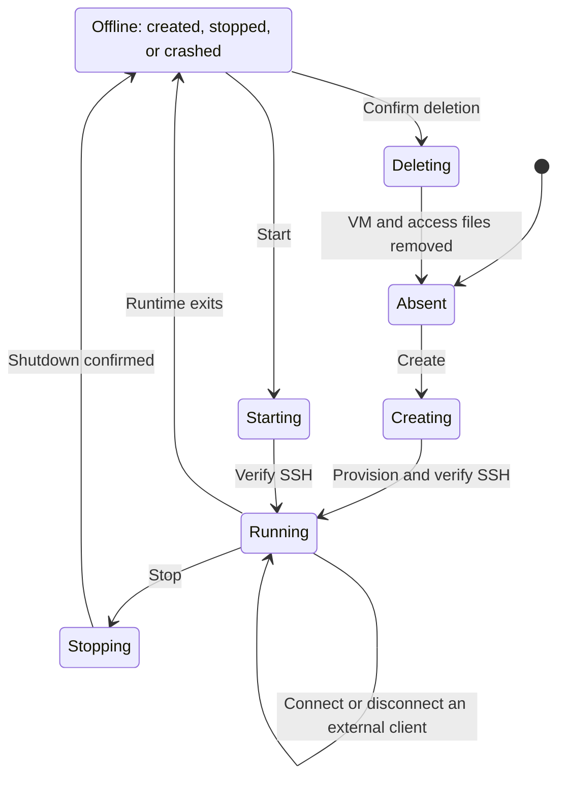

# Desktop App

`shroom-app` provides a Freya desktop interface for local SSH workspaces. The recurring workflow is
**choose or create → connect → work → leave → return**. The shell keeps the managed directory,
native workspace state, and next connection or recovery action visible throughout this loop.
It calls the [workspace core](shroom-core.md#ssh-workspace-core) and uses the
[agent integration exports](agent-integrations.md#attachments-and-native-applications) for connection text.
The app manages microsandbox workspaces; the separate Lume HTTP client is not exposed here.

## Desktop Layout

A muted sidebar, context toolbar, focused central view, and optional Details panel follow familiar agent-app
navigation. The center presents workspace operations and connection information. Shroom does not observe
external editor or terminal sessions and has no conversation composer.

| Surface | Content and interaction |
| --- | --- |
| Sidebar | New workspace, alphabetically ordered workspaces with native state labels, and access-only artifacts under **Needs attention** |
| Sidebar footer | Current directory; **Local workspaces** opens its environment settings |
| Context toolbar | Current selection, refresh, available lifecycle actions, and a Details toggle |
| Central view | Native runtime state, SSH readiness, one emphasized next action, and recent session activity |
| Details | Directory and private runtime storage, scoped `msb` inspection command, and available SSH connection fields |

One directory is open at a time. Selection survives state changes and failed cleanup when the target still
exists. **New workspace** opens a dedicated name and host-port form; values survive validation errors and
navigation within the app session. **Environment** presents directory and runtime paths, image availability,
explicit image import, and **Change directory**.

The app follows the system's light or dark appearance with neutral surfaces, restrained green status text,
native typography, and monospace connection text. Icons use Freya's official Lucide collection through
the `icons-lucide` feature, rendered at 16 pixels with inherited foreground colors. Icon-only controls have
named tooltips, accessible labels, keyboard activation and focus indicators, and disabled or expanded states.

The sidebar is 216 pixels wide. Below a window width of 960 pixels, a panel icon labeled **Show workspaces**
or **Hide workspaces** toggles navigation. Details dock on the right at widths of at least 1100 pixels
and otherwise follow the center content in its scroll view. Details can always be hidden.
The initial window is 1120 × 800; the minimum is 820 × 640.

## Opening Workspaces

Launch with `cargo run -p shroom-app --locked`. Setup accepts three absolute paths: the state directory,
the actual microsandbox executable, and its firmware library. Opening validates the installed runtime through
`Core::open` and reads its catalog. Errors remain visible so the paths can be corrected and opening retried.
Prepare the runtime and an image archive using the [repository instructions](../../README.md#local-runtime-and-image).

The state directory defaults to `$HOME/.shroom`. On macOS, the app suggests the runtime pair under
`/opt/homebrew/opt/microsandbox/libexec` when those files exist. Environment variables override these defaults:

| Variable | Setup field |
| --- | --- |
| `SHROOM_STATE_DIR` | State directory |
| `SHROOM_RUNTIME` | Actual microsandbox executable |
| `SHROOM_FIRMWARE` | Firmware library |
| `SHROOM_IMAGE_ARCHIVE` | Suggested archive path in the image import form |

Fields remain editable before opening and are retained for the app session; the app writes no settings file.
The displayed directory is canonicalized after opening. The directory session is independent of the workspace
lifecycle:



Opening discovers workspaces without starting them. Changing directory releases the current core and returns
to setup. Closing the app or changing directory leaves detached workspaces alive under the core's
[state ownership contract](shroom-core.md#state-ownership). Returning discovers them again.

## Image Setup and Recovery

Image preparation belongs to the open directory and gates creation only. Existing workspaces remain manageable
when the prepared image is missing. The creation form links to environment settings for explicit import of a
Docker or OCI archive built from `images/workspace`. **Import image** loads the archive through the SDK into
that directory's private home under the core's required image tag, then checks its architecture against the
host. The app does not build or download an image.

The worker checks image availability again immediately before `Core::create`, so a missing image fails before
access keys are generated. Older failed attempts can already have left access files without a native record.
Those names appear under **Needs attention**. Cleanup confirms the name, rechecks that no workspace now exists,
then delegates to `Core::remove`.
If creation fails after leaving a workspace or access files, the app selects its recovery view. A failure
that leaves no artifacts keeps the creation form available for correction.

An operation error does not prove absence or shutdown. The app rereads the catalog and access artifacts,
following the core's [partial-failure contract](shroom-core.md#operation-flows-and-failures).

| Observed result | Recovery |
| --- | --- |
| No VM or access files | Correct the problem and retry creation |
| Access files only | Confirm cleanup, then reuse the name |
| VM exists, SSH unavailable | Read the native state and error; verify again or explicitly stop/start |
| Initial SSH identity setup incomplete | Stop if needed, delete, then recreate |
| Shutdown or deletion failed | Refresh; retry when the observed state permits it |
| Catalog unreadable | Mark retained information stale and refresh |

If deletion removes the VM but leaves access files, recovery continues through incomplete-setup cleanup.
Canceling a confirmation changes no workspace state.

## Workspace Lifecycle and Actions

The UI projects native states into actions, preserving the actual **Created**, **Stopped**, and **Crashed**
labels. The core's [operation contract](shroom-core.md#operation-flows-and-failures) owns persistence, shutdown,
and deletion semantics. This diagram summarizes the successful paths presented by the app:



An externally paused workspace can be stopped; Shroom has no resume operation. Stopping ends client sessions
and preserves files. Deleting removes workspace data and access files. After a host reboot the user explicitly
starts a workspace, then obtains fresh [connection details](shroom-core.md#ssh-identity-and-connection-refresh).

| Selected state | Emphasized action |
| --- | --- |
| Running, SSH verified | Copy the selected connection format |
| Running, SSH unchecked or failed | Verify SSH |
| Created, stopped, or crashed | Start workspace |
| Paused | Stop workspace |
| Incomplete setup without a VM | Remove incomplete setup |
| Operation pending | Named progress; conflicting controls disabled |
| Catalog stale or unavailable | Refresh |
| Empty library | New workspace |

The ellipsis menu, labeled **Workspace actions**, offers stop for running or paused workspaces and deletion
for created, stopped, or crashed workspaces. Deletion requires a confirmation naming the workspace and warning
that its files will be lost.
Changing selection or starting another operation clears that confirmation. The core checks actual runtime
quiescence at deletion time.

## Connection Readiness and Export

Native runtime state, authenticated SSH readiness, and an external client's connection are separate facts.
Discovery and refresh do not probe SSH. Successful creation, start, or explicit verification records the
connection and the check time. Copying a command does not mark access verified or a client connected.
Verification on a workspace already observed stopped is rejected; start remains an explicit action.

| Concern | States |
| --- | --- |
| Workspace image | Unknown, missing, ready |
| SSH check | Unchecked, checking, verified, failed |
| Catalog | Current, stale or unavailable |
| Operation | Idle, busy with the operation named |
| External client | Outside Shroom's observation |

A verification result describes its recorded time, displayed in UTC. It is invalidated by a new lifecycle
operation for that workspace, a changed connection, a nonrunning state, a directory change, or a failed catalog
read. Reopening a directory begins with unchecked access. A running label alone never establishes readiness.

The connection panel switches between **Command** and **SSH config**. Both are selectable and use the complete
shared integration renderer. Copying fetches current core details again and checks them against the subsequent
catalog snapshot before writing to the clipboard. A changed endpoint or failed catalog read discards the
export. Connection text and endpoint details are withheld while a request is pending or the catalog is stale.
Clipboard failures leave selectable connection text and an error.

The POSIX-shell command works without editing SSH configuration. The config stanza belongs before matching
client defaults. The suggested alias is `shroom-<workspace-name>`; choose distinct aliases across directories.
The [integration reference](agent-integrations.md#attachments-and-native-applications) owns trust settings,
quoting, native client setup, and guest working-directory behavior.

Details shows the current endpoint, user, identity path, guest directory, and host identity when available.
Its **Inspect with msb** entry expands a selectable command with `MSB_HOME` and `MSB_CONFIG_PATH` pointing at
this directory's private runtime storage. The default CLI catalog can therefore differ from Shroom's catalog.

## Responsiveness and Activity

A Tokio worker executes requests while Freya handles rendering and input. One mutex owns the core, and the
interface permits one operation at a time. The Freya task awaiting the worker belongs to the app root, so
removing a confirmation control or menu cannot cancel result delivery or leave the interface busy.
Closing during an operation can leave partial artifacts under the core's existing failure contract.

Every request rereads the catalog, including failed mutations. If that read fails, workspace actions are
disabled until refresh succeeds; the operation error and refresh error remain separately visible.
A worker failure also clears busy state, invalidates connection information, and asks for refresh.

Activity records completed operations and errors for the current directory session, with UTC timestamps and
expandable diagnostics. The model retains the latest 32 entries and shows up to four for the selected workspace;
environment and empty-library views show the latest directory activity, including completed removals.
Pending progress remains in the toolbar area. Activity is not persisted and clears
when changing directories. Error details remain selectable.

## Validation

`cargo test -p shroom-app --locked` covers accepted and rejected form inputs, operation serialization in the
UI model, failure reconciliation, selection changes, unavailable runtime retries, and Freya interaction tests
for deletion confirmation, result delivery after confirmation closes, disabled actions, compact navigation,
appearance changes, and preservation of form input.
Readiness tests distinguish discovery and export from authenticated verification and invalidate old proof
when the endpoint, runtime state, directory, or catalog availability changes.
These tests do not boot VMs.
The [core evaluation](../evaluations/2026-09-20-minimal-core/README.md) records runtime validation separately.
The [app evaluation](../evaluations/2026-09-20-desktop-app/README.md) records the GUI checks and the passing
macOS ARM64 image-recovery and lifecycle test.

An opt-in app acceptance test reproduces the missing-image failure in a temporary root, checks that the
preflight creates no access artifacts, removes an orphaned setup, rejects a bad archive, imports a valid
archive, and exercises creation, SSH verification, both export formats, a real SSH login using the copied
command, stop/start, rejection of verification for a stopped workspace, and removal:

```sh
SHROOM_TEST_RUNTIME=/path/to/msb \
SHROOM_TEST_FIRMWARE=/path/to/libkrunfw \
SHROOM_TEST_IMAGE_ARCHIVE=/path/to/workspace.tar \
  cargo test -p shroom-app model::tests::missing_image_recovery_and_workspace_lifecycle \
  --locked -- --ignored --exact --nocapture
```

The test uses port 34882 unless overridden with `SHROOM_APP_TEST_PORT`. It removes its disposable workspace
and temporary root on success, and preserves the printed state root for diagnosis on failure.

Another opt-in test clicks through incomplete-setup cleanup in Freya against a real core in a temporary
directory, verifies removal, and checks that refresh and disconnect remain usable. It does not boot a VM:

```sh
SHROOM_TEST_RUNTIME=/path/to/msb \
SHROOM_TEST_FIRMWARE=/path/to/libkrunfw \
  cargo test -p shroom-app ui::tests::confirmed_cleanup_completes_through_the_ui_with_a_real_core \
  --locked -- --ignored --exact --nocapture
```

An optional headless render supports visual inspection of setup, creation, environment, recovery,
compact navigation, and running workspaces in both appearances:

```sh
mkdir -p /tmp/shroom-preview
SHROOM_PREVIEW_DIR=/tmp/shroom-preview \
  cargo test -p shroom-app ui::tests::render_preview --locked -- --ignored
```
