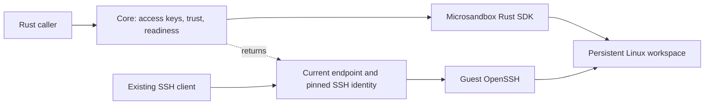

# Shroom Core

This reference defines Shroom's SSH workspace core and its Lume HTTP client.
The workspace core uses the microsandbox SDK to provide verified SSH access to persistent Linux guests.
The Lume client exposes native Linux and macOS VM operations through a separately managed local service.
Their contracts are described below; the remaining shared workspace integration is tracked in the
[Lume workspaces proposal](../proposals/lume-workspaces.md).

## SSH Workspace Core

The [core validation report](../evaluations/2026-09-20-minimal-core/README.md) records the passing macOS ARM64
acceptance run and the remaining Linux x86-64 runtime validation.

### Purpose and Scope

Shroom makes microsandbox's persistent Linux sandboxes usable by existing SSH clients.
Microsandbox already owns sandbox creation, lifecycle, filesystem persistence, and runtime status.
Shroom adds a prepared guest profile, SSH access material, and a small API returning connection details.
The [workspace idea](../ideas/ssh-workspace-manager.md) supplies the broader product context.

Implement one Rust library with six workspace operations: create, list, get, start, stop, and remove.
Use microsandbox on macOS ARM64 and Linux x86-64.
Each workspace has one non-root guest user and one client key that its authorized clients can share.
Files, installed tools, the guest account, and the SSH host key survive stop/start
through the runtime's existing filesystem persistence.

Use a preinstalled, pinned runtime and one prepared OCI image built for each target architecture.
Keep UI, CLI, agent installers, launch recipes, tunnel management, runtime downloaders,
autostart, migration, and automatic recovery outside the core.
A stable loopback endpoint is not required.
Ordinary SSH clients supply shell execution, SFTP, and application tunnels.

Tart and direct Virtualization.framework integration are deferred.
Implement no provider trait, provider registry, or compatibility layer for a hypothetical second runtime.

### Architecture and Responsibility

The library calls the microsandbox SDK directly.
OpenSSH runs inside the guest, and microsandbox publishes its port on host loopback.
A running workspace remains usable after the Shroom caller exits through the runtime's detached mode.
Shroom needs no resident process or SSH server of its own.



| Responsibility | Owner |
| --- | --- |
| Lifecycle, disks, native identifiers, and runtime status | Microsandbox |
| Guest command execution, filesystem access, networking, and port publishing | Microsandbox |
| Prepared image and SSH provisioning through the SDK | Shroom's guest profile and core |
| Client key, pinned host key, readiness check, and connection details | Shroom core |
| SSH protocol, shells, SFTP, and forwarding | Guest OpenSSH and existing SSH clients |
| Refreshing a client's saved connection | Caller or later client integration |

Microsandbox's catalog is the source of truth.
Shroom reads it and adds SSH access information; it does not implement another catalog,
VM state machine, process supervisor, or network stack.
Use native SDK types and errors wherever they already express the required meaning.

### Workspace API

`Core` serializes mutations with `&mut self`; SSH sessions remain independently concurrent.
Opening a core acquires the state-directory lock before configuring the local SDK backend.
The public API uses the following signatures.
`SandboxStatus` is the pinned SDK's native status type; the other domain types below belong to Shroom.

```rust
pub struct Workspace {
    pub name: WorkspaceName,
    pub state: SandboxStatus,
    pub options: WorkspaceOptions,
    pub ssh: Option<SshConnection>,
}

pub struct SshConnection {
    pub endpoint: SocketAddr,
    pub user: String,
    pub identity_file: PathBuf,
    pub host_key: HostPublicKey,
    pub host_key_alias: HostKeyAlias,
    pub known_hosts_file: PathBuf,
    pub directory: String,
}

impl Core {
    pub async fn open(state_dir: PathBuf, config: Config) -> Result<Self>;
    pub async fn create(
        &mut self,
        name: WorkspaceName,
        host_ssh_port: HostPort,
        options: WorkspaceOptions,
    ) -> Result<Workspace>;
    pub async fn list(&self) -> Result<Vec<Workspace>>;
    pub async fn get(&self, name: &WorkspaceName) -> Result<Workspace>;
    pub async fn start(&mut self, name: &WorkspaceName) -> Result<Workspace>;
    pub async fn stop(&mut self, name: &WorkspaceName) -> Result<()>;
    pub async fn remove(&mut self, name: &WorkspaceName) -> Result<()>;
}
```

`Config` contains `runtime_executable` and `firmware` paths for the pinned runtime pair.
The executable must be the binary itself, since SDK version inspection does not execute shell wrappers.
The fixed image is `localhost/shroom-workspace:0.1.0`, imported into the private SDK home before creation.
Shroom uses `PullPolicy::Never`; the [repository setup instructions](../../README.md) describe the explicit import.
`HostPort` validates 1024–65535 before use. Choosing a port explicitly avoids adding an allocator.
Microsandbox may retain its native mapping across restarts; Shroom always reads the current endpoint instead
of promising address stability or maintaining its own mapping.

`WorkspaceName` parses a lowercase ASCII slug of 1–48 characters.
The first character is a letter or digit; later characters may also be hyphens.
Its inner string is private so it is safe to use as an access-directory name.
`HostPublicKey` and `ClientPublicKey` are distinct validated Ed25519 public-key types used at the SSH boundary.
Native sandbox identity remains the SDK's responsibility.

`WorkspaceOptions` selects a `GuestUser` and a list of `HostFolder` mounts at creation.
Its default is `developer` with no shared folders. These choices persist in the SDK catalog and are returned
on `Workspace`, including while stopped. The [guest profile](#guest-profile) defines their constraints.
The core offers no account rename or mount-edit operation after creation; the pinned SDK's modification API
does not support changing mounts. A later account rename would require a separate guest and client migration.

| Operation | Shroom contract |
| --- | --- |
| `open` | Validate prerequisites and scope SDK storage to the supplied root; start no sandboxes |
| `create` | Create a new sandbox through the SDK, provision SSH once, pin its host key, and verify access |
| `list` / `get` | Read the SDK catalog and available SSH details without starting or provisioning anything |
| `start` | Start an existing sandbox through the SDK, launch guest SSH when newly booted, and verify existing access |
| `stop` | Use SDK graceful shutdown with a timeout; never force termination automatically |
| `remove` | Use SDK removal only after confirming no runtime remains, then remove access files; absence is a successful no-op |

Successful core `create` and `start` return `Some(ssh)` after a strict authenticated probe.
`get` and `list` return SSH details only for a running sandbox with an available endpoint and complete access material.
They still show other native states and partially created sandboxes.
An observed `Running` status alone is not an SSH health guarantee.
Malformed existing access files produce errors; missing or incomplete access material is diagnosed
by `start` and is never repaired implicitly.
The directory is a client hint; an ordinary SSH session begins in the account's home.

### SSH Identity and Connection Refresh

Generate a unique guest host key once during creation and read its public half
through the SDK's guest administration channel.
Microsandbox preserves that key with the guest filesystem on later starts.
The prepared image must not carry another workspace's host identity.
Never establish trust by accepting an unauthenticated network scan or replacing a mismatched key.

Store the pin in a dedicated `known_hosts` file under an alias derived from the host-key fingerprint,
rendered as a safe ASCII identifier.
The alias is independent of the endpoint and display name.
The connection exports both the public key and that alias: OpenSSH can use the file,
while another SSH implementation can use the public key for explicit pinning.

The core's OpenSSH probe uses `HostKeyAlias`, `UserKnownHostsFile`, `StrictHostKeyChecking=yes`,
`CheckHostIP=no`, and only the workspace identity file.
Ignore ambient SSH configuration, SSH agents, and interactive input.
Disabling the extra IP check retains verification against the pinned host key.
OpenSSH explicitly supports this separation through [`HostKeyAlias`](https://man.openbsd.org/ssh_config#HostKeyAlias).

Callers obtain fresh connection details after each start and before reconnecting.
They can update the `HostName` and `Port` of a stable SSH config alias without changing the trust pin.
The core returns data; it does not edit global SSH configuration, watch addresses, or operate a DNS service.
A stale endpoint must fail verification if it now belongs to another workspace.

Some clients cache connection fields or implement only part of SSH configuration.
For example, [ZCode's documented alias handling](https://zcode.z.ai/en/docs/remote-development) only prefills host,
port, username, and key path.
Do not promise automatic refresh or `HostKeyAlias` support in every app.
Such clients need their own verified pinning and refresh path, or an explicit manual reconnect.
Existing sessions and application tunnels do not survive a VM restart.

### State Ownership

Give the SDK a dedicated home and configuration path under `microsandbox/`.
The SDK sandbox name is the workspace name inside this private catalog; no name or native-ID mapping is needed.
Shroom stores only its access artifacts and directory lock alongside the runtime's own files.

```text
<state_dir>/
  core.lock
  microsandbox/                 # SDK-owned configuration, catalog, images, and disks
  access/
    <workspace-name>/
      client_ed25519            # private key, host only
      client_ed25519.pub
      known_hosts               # pinned host key under an address-independent alias
```

One exclusive OS file lock prevents two Shroom instances from provisioning or changing access files in the same root.
The lock is released when the core or caller exits.
Detached sandboxes continue independently, and the SDK supplies their status on reopening.
Direct external mutation of this private catalog is unsupported; Shroom does not adopt unrelated sandboxes.
State paths must fit the SDK's Unix socket path limit and be UTF-8 without control characters or `$`.
OpenSSH path options quote spaces and escape literal percent characters.

Keep access directories mode `0700` and client private keys mode `0600`.
The private host key and authorized client public key remain in the guest.
Never copy client private keys, personal SSH identities, or host credentials into the guest.

### Guest Profile

Build one Debian-based OCI image recipe with the guest account, tools, and OpenSSH configuration.
Use 2 vCPUs and 4 GiB of memory, with no automatic idle expiry.
The SDK supplies guest administration; Shroom adds no guest agent or custom command protocol.

The guest includes OpenSSH, Bash, Git, CA certificates, and basic download/archive utilities.
The account defaults to `developer`; callers may choose a different login name at creation.
`GuestUser` accepts 1–32 lowercase ASCII letters, digits, underscores, or hyphens, starting with a letter,
and rejects `root`. Provisioning rejects names already used by another image account or group.
The account retains UID/GID 1000 and has a writable home and `/home/<user>/workspace`, with no sudo grant.
Store an optional username override in the SDK's `shroom.user` label; absence means the default account.
OpenSSH accepts only public-key login for that account and supports shells, SFTP, and local forwarding.
Disable root/password/keyboard-interactive login, SSH-agent forwarding, and X11 forwarding.
Keep the authorized public key and service configuration root-owned outside the user's home.

Remove image-build host keys and default image credentials.
The core embeds the checked-in SSH helper and installs it through SDK filesystem access during creation.
First-time provisioning renames the image's account and home when requested, selects it in `AllowUsers`,
installs the public client key, generates the host key, and launches SSH.
Later boots require those keys to exist; they never invoke a key-regeneration fallback.
SDK administration starts at `/`, which exists before the selected account's home is provisioned.

Host folders are optional explicit directory binds, each with a host path, guest path, and `FolderAccess`.
`HostFolder::new` resolves an existing host directory to its canonical path. Guest destinations must be normalized
paths below `/mnt`, such as `/mnt/project`; destinations cannot overlap. Keeping mounts outside the account and
service directories prevents them from covering provisioning files. Reject sources that contain or are inside
Shroom's state directory. Recheck sources before creation and start; a missing or redirected directory fails
without creating a replacement. Reading the catalog does not require the source directory to be present.

Read-only access is the default. Read/write access exposes edits and deletions directly to the host.
Use the SDK's strict stat virtualization with guest owner 1000:1000, private host permission handling,
`nosuid`, and `nodev`. Keep its default write quota and reject ambient settings that change the selected mounts.
Workspace removal removes the VM and access artifacts; selected host directories remain host-owned.
Shroom projects no host credentials automatically. Any files within a selected folder are available according
to that folder's access mode.

Configure the SDK's networking policy to allow public egress while restricting host/private-network access.
Publish SSH on host loopback only.
Validate these settings on the pinned runtime; Shroom implements no packet filtering or port-forwarding service.

### Microsandbox Integration

Use an explicit local SDK backend with both its home and configuration path under `microsandbox/`. Scope calls through
the SDK's backend facility and preserve machine policy; reject mounts that differ from the selected folders
or automatic credential projection. Keep SDK handles within an operation so native identity checks remain effective.
The
[local backend source](https://github.com/superradcompany/microsandbox/blob/e9565401dacde7e5c3a8fb935574c785aa1bc8f1/sdk/rust/lib/backend/local/mod.rs)
explains why setting only the home does not isolate configuration.

Create and start in detached mode.
Use the SDK administration channel to provision the guest, read its public host key, and start the fixed SSH helper.
Do not assume image CMD launches the service.
Publish `127.0.0.1:<host_ssh_port>` to guest port 22 and read the mapping for a running VM's endpoint.
Use the SDK's graceful stop with a timeout and consume every catalog page when listing.
These facilities are described by the [sandbox API](https://docs.microsandbox.dev/sdk/rust/sandbox)
and [lifecycle guide](https://docs.microsandbox.dev/sandboxes/lifecycle).

Reject a requested port already recorded for another managed workspace, including a stopped one.
The runtime's actual bind is authoritative for external conflicts; do not rely on a check-then-release socket.
An occupied persisted port may make a later start fail.
The SSH contract permits address changes but does not require automatic port reassignment
or rewriting microsandbox's persisted configuration.

The SDK is pinned to `e9565401dacde7e5c3a8fb935574c785aa1bc8f1`, which reports version 0.7.2.
Use the matching preinstalled 0.7.2 executable and firmware; the validation report identifies the tested macOS pair.
SDK runtime resolution checks the pair's paths, and SDK executable inspection rejects unexpected or absent versions.
OpenSSH survives its launch command and caller exit in the tested guest profile.

### Operation Flows and Failures

Creation validates the request, rejects existing native names or access directories, and generates the client key.
It creates a detached sandbox through the SDK, provisions guest SSH through the SDK's administration channel,
persists the host-key pin, then probes the published endpoint.
Success means an authenticated non-root SSH connection worked.
The probe and all bootstrap/discovery waits have finite deadlines.
The implementation bounds boot at 120 seconds, guest administration and endpoint discovery at 15 seconds,
and graceful stop at 30 seconds. Each host helper also has a finite deadline and terminates on cancellation.

Start requires an existing sandbox and existing access files.
It starts or inspects that sandbox, discovers its current endpoint,
and verifies the original pin with the original client key.
It never creates a replacement VM.
A changed address with the same host key succeeds; a different host key fails even when the address is unchanged.

For an already running sandbox, start discovers and probes without reprovisioning or relaunching OpenSSH.
Use SDK lifecycle methods to handle in-progress transitions within a deadline; add no parallel state machine.
Normal operations do not resume paused sandboxes or expose snapshots and suspend/resume controls.
If SSH has failed in a running VM, return a readiness error; an explicit stop/start is the repair path.

Stop is idempotent for an already stopped VM.
A timeout preserves disks and access files, and the accepted shutdown request may still complete later.
Remove requires confirmed runtime quiescence, including for a partially created or crashed record.
Use SDK removal after confirming no runtime remains, then delete access artifacts.
Reject removal while starting, running, draining, or paused.
Retry may finish access cleanup when the sandbox is absent.
Removing one workspace does not prune shared image caches.

Creation is not transactional across access files and SDK operations.
An error or cancelled operation can leave a VM, access files, or both.
Return the workspace name, failed stage, and original error source.
Leave partial artifacts for explicit `remove`; add no rollback journal, automatic adoption, or garbage collector.
A host-only access directory blocks name reuse until removal confirms the VM is absent and cleans it.
A sandbox whose initial host-key pin was never stored must be removed and recreated.

Preserve typed SDK errors with operation context and their original sources,
including lifecycle conflicts, missing sandboxes, unsupported states, and stop timeouts.
Add Shroom errors only for its own boundaries, including invalid names/ports, access-directory and port conflicts,
malformed access files, helper failures, `CoreInUse`, `AccessIncomplete`, `HostKeyMismatch`, and `SshUnavailable`.
Do not duplicate the SDK's runtime error taxonomy.

Ordinary helper subprocesses terminate on cancellation.
Successfully launched VM runtimes are the explicit exception: ownership belongs to microsandbox,
and cancellation does not imply shutdown or rollback.
Dropping the core releases its lock, not its workspaces.
After host reboot, callers explicitly start them.
Logs contain bounded diagnostics without private keys or authentication secrets.

### Acceptance Tests

Exercise the workspace contract against the real microsandbox runtime on both target platforms.
Focus on Shroom's SSH setup and selected SDK configuration; do not recreate upstream's general test suite.
Add small unit tests for names, ports, and SSH trust handling.
Do not build a mock hypervisor framework.

| Test | Successful case | Rejected or failure counterpart |
| --- | --- | --- |
| Input and ownership | Valid name/port; one core per root | Invalid names/ports or a second core; existing state unchanged |
| Creation | Fresh name, unique guest host key, usable SSH | Duplicate name preserves the original; the image supplies no shared host key |
| Access | Workspace A's key enters A as developer | A's key cannot enter B; root and password login fail |
| Guest permissions | Shell and SFTP write in the developer home | Both fail to write a root-owned test file |
| Persistence | Files, installed executable, and host key survive stop/start | Missing workspace or access material is not recreated |
| Endpoint refresh | Changed endpoint with the original host key connects | Stale endpoint reaching another VM fails; stored trust stays unchanged |
| Address discovery | Running VM eventually returns its current endpoint | Stopped VM has no endpoint; bounded discovery failure does not hang |
| Caller lifetime | VM and guest SSH survive caller exit and core reopening | Ordinary cancelled helpers do not continue modifying access files |
| Shutdown and cleanup | Graceful stop then remove; partial cleanup retries | Timeout never kills; running or paused removal preserves data |
| Isolation | Guest uses its own files and permitted public network | Host files, host services, credentials, and other workspaces stay inaccessible |
| Client attachment | One real client reconnects after connection refresh | Ignored pinning/config options are detected, not assumed supported |

Also check occupied ports, loopback-only publishing, and complete paginated discovery through Shroom.
The endpoint-refresh test exercises SSH trust at another endpoint; it adds no port-reassignment API.
Native SSH forwarding is exercised through an external client; the core owns no application tunnels.

### Organization and Validation

Keep the workspace core in one crate with `lib.rs` for the public types, `core.rs` for SDK calls and operation flows,
and `access.rs` for keys, trust files, and SSH probing.
Keep the image recipe and fixed guest SSH files under `images/workspace/`.
Add modules only when implementation size makes them useful.

Use the microsandbox SDK, `tokio`, `thiserror`, and a small validated SSH-key representation as needed.
Use OS file locking from the selected Rust toolchain or one small dependency.
Register every dependency in the root workspace manifest, as required by `AGENTS.md`.
Host `ssh` and `ssh-keygen` are explicit prerequisites; invoke tools without a shell.

The library lives under `crates/shroom-core`; tests use the real SDK and opt into a prepared local runtime.
The initial implementation followed the runtime proof with the concrete core, trust tests, and client/isolation checks.
The validation report owns experimental evidence and outstanding platform checks.
The [agent integration layer](agent-integrations.md) provides connection exports and command recipes outside
the core. Full application compatibility validation and runtime/image distribution remain further product work.

If later validation exposes a gap requiring Shroom to implement VM supervision, persistence, or networking,
revisit the runtime choice or scope before expanding the core.

## Lume HTTP Client

Shroom uses Lume through a typed Rust HTTP client in `crates/shroom-lume`.
The caller supplies a separately installed, running Lume service on the same Mac.
This follows the approved choice to use Lume's HTTP API: the reviewed Swift package exports an executable,
so it cannot be imported as a Swift or Rust framework. Shroom invokes no Lume CLI commands.

The client provides native VM operations for Linux and macOS guests. The SSH workspace contract remains
defined in [SSH Workspace Core](#ssh-workspace-core); a Lume VM is not yet an implementation of that contract.
The [workspace integration proposal](../proposals/lume-workspaces.md) identifies the service capabilities
needed before both runtimes can share that interface.

### Service and Storage

`Client::new(Config)` validates configuration and constructs an HTTP connection pool without contacting
the service or starting VMs. `Config` requires a literal loopback socket address, an absolute storage
directory, and a positive request timeout of at most one hour. The timeout covers the complete exchange,
including response-body reads. Installation, service supervision, and image preparation remain external.

Every operation sends the storage directory using the endpoint's native query or JSON field.
Use a dedicated Lume service and storage directory. The reviewed service caches running VMs by name alone,
so storage arguments do not isolate concurrent same-name VMs in other roots handled by that service.
Client clones share connections; they do not implement a catalog or an ownership lock.

Storage paths must be UTF-8 and contain no parent components, control characters, or literal percent signs.
Lume decodes storage query values twice, which makes a literal percent sequence ambiguous.
The client encodes spaces as `%20` because Lume's Foundation parser leaves `+` literal.
`VmName` accepts lowercase ASCII slugs of 1–48 characters, starting with a letter or digit;
registry references and path separators are excluded.

The client disables HTTP redirects, automatic retries, and ambient proxies. Responses are bounded to
1 MiB, with error diagnostics limited to 1,024 characters. HTTP errors preserve their status and message;
in particular, a native `400` is not translated into a missing-VM error. Cancelling or timing out a request
does not undo work the service has already accepted.

### Operations and Results

| Rust operation | Native behavior |
| --- | --- |
| `list` / `get` | Read native VM state and available inspection fields within the storage scope |
| `create` | Request Linux disk allocation or macOS installation from an explicit local IPSW |
| `clone_vm` | Clone a prepared, stopped VM within the same storage scope |
| `start` | Request headless execution with NAT networking |
| `force_stop` | Invoke native stop, which may cut VM power or terminate the VM process |
| `force_delete` | Invoke native deletion, which may stop a VM and permanently deletes its disks |

Creation and start return `Accepted` for HTTP `202`; callers inspect `get` to observe subsequent state.
The result is neither a completed boot nor authenticated SSH access. `VmState` preserves unrecognized
states as `Unknown`, and sparse pulling responses leave unavailable fields as `None`.
The `ssh_available` field is Lume's reachability hint, not a verified SSH connection.

Linux creation allocates an empty VM; callers need a prepared bootable VM for cloning.
macOS installation does not establish Shroom's guest account or SSH identity.
Cloning copies the guest filesystem, including any embedded credentials and host keys.
The client does not describe cloning as workspace provisioning.

Start explicitly disables VNC, clipboard synchronization, and directory sharing.
NAT remains Lume's native policy; it does not implement the core's restricted public egress or loopback
SSH port publishing. Destructive native methods retain explicit `force_` names so they cannot be mistaken
for the core's graceful shutdown and quiescent removal contracts.

### Compatibility and Validation

`REVIEWED_REVISION` records the Cua source commit used to verify request and response formats.
It is a compatibility reference, not a runtime version negotiation mechanism.
Use that revision with the [routing patch](../../integrations/lume/http-routing.patch), or an upstream
revision verified to include an equivalent fix. The reviewed router does not match storage-scoped listing
requests; the patch removes the query from route matching. The client never falls back to unscoped listing.

The [evaluation](../evaluations/2026-09-20-lume-http/README.md) records HTTP fixture tests and executable
Swift source checks. Live Lume service and VM acceptance for both guest operating systems remains outstanding.
